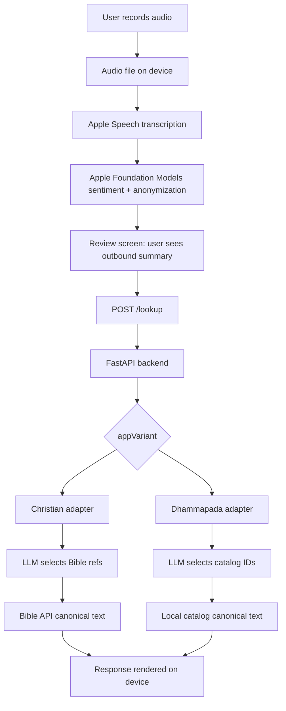

# Freely Spoken

Privacy-first native iOS app for turning a spoken reflection into a short, canonical passage response.

Freely Spoken records audio, transcribes it on-device, uses Apple Foundation Models to extract sentiment and remove identifying details, then sends only the anonymized summary and emotion metadata to a small FastAPI backend. The backend uses an LLM for reference selection only; canonical text comes from trusted sources, not from generated model output.

This repository contains the iOS app, the hosted lookup backend, and the local prompt/debug tooling used to test the privacy and response-selection pipeline.

## Why this project exists

Most voice + LLM products send raw user input to a cloud model. This project explores a stricter architecture:

1. Keep audio on the phone.
2. Keep the raw transcript on the phone.
3. Use on-device AI to produce a private summary.
4. Show the user exactly what will leave the device.
5. Send only that anonymized payload to a backend.
6. Use hosted inference for matching, not for authoring canonical text.

The result is a small product surface, but it exercises a lot of real engineering work: native iOS capabilities from React Native, on-device LLM orchestration, privacy-preserving request shaping, backend provider fallback, curated catalog lookup, CI, and release-oriented documentation.

## For reviewers

If you are evaluating this repo as a portfolio project, these are the parts I would look at first:

- [services/lookup-request.ts](services/lookup-request.ts) - the privacy boundary. It builds the only request shape allowed to leave the device and explicitly drops extra fields.
- [hooks/sentiment-utils.ts](hooks/sentiment-utils.ts) - pure parsing, normalization, and anonymization guard logic extracted away from React Native so it can be tested quickly.
- [hooks/__tests__/use-sentiment-analyzer.test.ts](hooks/__tests__/use-sentiment-analyzer.test.ts) and [services/__tests__/lookup-request.test.ts](services/__tests__/lookup-request.test.ts) - tests for messy model output, confidence normalization, JSON extraction, and leak prevention.
- [app/index.tsx](app/index.tsx) - the current end-to-end mobile flow: recording -> processing -> review -> lookup -> results.
- [server/app/main.py](server/app/main.py) - the FastAPI HTTP layer: auth header handling, crisis flagging, variant dispatch, structured error responses, and privacy-conscious logging.
- [server/app/llm_runner.py](server/app/llm_runner.py) - bounded provider fallback and retry behavior.
- [server/app/lookup/dhammapada.py](server/app/lookup/dhammapada.py) - a catalog-backed adapter where the LLM selects IDs from an approved shortlist and the server rejects malformed output.
- [server/tests](server/tests) - hermetic backend tests; LLM calls are stubbed.
- [.github/workflows/ci.yml](.github/workflows/ci.yml) - lint, TypeScript, Vitest, and backend pytest checks on push/PR.

## What it demonstrates

- **Privacy-by-construction mobile architecture**: the outbound request is assembled field-by-field from an allowlist instead of forwarding a broader object.
- **Native iOS integration from Expo/React Native**: audio recording, Apple Speech transcription, and Apple Foundation Models require a native iOS build and real Apple Intelligence-capable hardware.
- **On-device model hardening**: the sentiment analyzer handles loose labels, percentage strings, comma-joined emotions, malformed JSON, code fences, and unsafe anonymized output.
- **Backend reliability under free-tier constraints**: a configurable provider chain (Cerebras/Groq/Cloudflare/OpenRouter and others) with bounded retries for transient failures and fall-through on malformed output.
- **Canonical-source discipline**: the LLM chooses references or catalog IDs; it does not produce scripture or Dhammapada text.
- **Variant-aware product architecture**: one codebase can ship multiple iOS apps by build-time variant selection.
- **Safety-aware catalog design**: the Dhammapada adapter excludes high-risk passages before the LLM sees the shortlist when a crisis flag is present.
- **Release-minded tooling**: local Swift CLI, lookup harness, privacy policy draft, and CI-backed tests.

## Product variants

The implemented product is branded as **Freely Spoken**. (The repo was originally named `mic-check`; the Expo slug and bundle identifiers retain that name because they are bound to the existing EAS project and App Store records.)

| Variant | Product name | Status | Response source |
| --- | --- | --- | --- |
| `christian` | Freely Spoken | In TestFlight — [join the beta](https://testflight.apple.com/join/pSCfy6s8) | LLM selects Bible references; server fetches canonical Bible text |
| `dhammapada` | Idle Ashes | In TestFlight (second build variant) | LLM selects IDs from a backend-owned Dhammapada catalog; server returns stored canonical text |
| `stoic` | Unreleased stub | Stub only | Planned curated Stoic catalog |

The app is intentionally single-turn. It does not have accounts, persistent history, chat memory, feeds, or a social layer.

## Architecture



### Mobile state machine

[app/index.tsx](app/index.tsx) drives the main user flow:

```text
idle -> recording -> processing -> review -> responseLookup -> results
```

Each pipeline stage is isolated in a hook with the same shape:

```ts
{ result, isLoading, error, action, reset }
```

The current hooks are:

- [hooks/use-audio-recorder.ts](hooks/use-audio-recorder.ts) - captures audio and tracks duration/input level.
- [hooks/use-transcriber.ts](hooks/use-transcriber.ts) - transcribes audio on-device with Apple Speech.
- [hooks/use-sentiment-analyzer.ts](hooks/use-sentiment-analyzer.ts) - calls Apple Foundation Models and normalizes output.
- [hooks/use-spiritual-response-lookup.ts](hooks/use-spiritual-response-lookup.ts) - sends the approved private summary to the backend.

### Privacy boundary

The only network request from the app is the lookup call. Its request body is:

```ts
{
  appVariant: "christian" | "dhammapada" | "stoic";
  anonymizedText: string;
  sentiment: string;
  emotions: string[];
  confidence: number;
}
```

The request must never include:

- audio
- raw transcript
- audio file path
- recording duration
- device identifiers
- location
- account or session identifiers

That rule is enforced in code by [services/lookup-request.ts](services/lookup-request.ts), and tested in [services/__tests__/lookup-request.test.ts](services/__tests__/lookup-request.test.ts).

### On-device sentiment and anonymization

The Foundation Models output is treated as untrusted model output, even though it runs locally. The app normalizes and guards it before use:

- loose sentiment labels are mapped to `positive`, `negative`, or `neutral`
- emotion aliases like `happy`, `sad`, and `angry` are normalized
- confidence values support `0.85`, `85`, and `"85%"`
- fallback text generation is parsed with a brace-matching JSON extractor
- anonymized text is rejected if it preserves protected terms, sensitive patterns, or too much source wording
- rejected anonymized text falls back to a generic category-based sentence, never the raw transcript

Most of this logic lives in [hooks/sentiment-utils.ts](hooks/sentiment-utils.ts), which has no React Native dependency and is covered by Vitest.

### Backend lookup

The backend is a FastAPI service under [server](server). `POST /lookup`:

1. validates the request body
2. enforces `X-Lookup-Client-Secret` when configured
3. scans anonymized text for crisis keywords
4. dispatches by `appVariant`
5. calls the configured provider chain for reference selection
6. fetches or loads canonical text
7. returns a primary response plus alternates

The backend logs operational metadata such as request ID, variant, sentiment label, outcome, latency, provider, retry count, and fallback usage. It intentionally does not log the anonymized text body.

### Provider fallback

[server/app/llm_runner.py](server/app/llm_runner.py) runs a configurable provider
chain (set with `LOOKUP_PROVIDER_ORDER`). The production chain runs the free
tiers first, with paid Hugging Face inference as the final backstop if
everything else fails:

```text
Groq -> Cerebras -> Mistral -> Cloudflare -> OpenRouter -> Cohere -> Together -> NVIDIA -> Hugging Face (paid)
```

Behavior:

- `429` rate limits immediately fall through to the next provider
- transient `5xx`, timeout, and connect errors retry with bounded jittered backoff
- non-retryable provider errors move to the next provider
- **malformed output** (output that passes HTTP but fails an adapter's
  validation — bad JSON, an out-of-shortlist ID) is treated like a provider
  failure and falls through to the next provider rather than failing the request
- all-provider exhaustion returns a structured backend error

Provider adapters exist for Gemini, OpenRouter, Groq, Cloudflare, Together,
Cerebras, Cohere, Mistral, NVIDIA, and Hugging Face. Free-tier limits vary widely (e.g. Gemini Flash's free quota is only a
handful of requests per day, while Groq and Cerebras are far more generous), so
order the chain by what your keys can actually sustain. A useful catalog of
free LLM API tiers and limits:
[cheahjs/free-llm-api-resources](https://github.com/cheahjs/free-llm-api-resources).

### Dhammapada catalog adapter

The Dhammapada/Idle Ashes variant uses a curated backend catalog instead of asking a model to know exact passage numbers.

Important properties:

- The catalog covers all 423 Dhammapada verse numbers as 414 rows because some verses are grouped couplets.
- The runtime catalog is stored at [server/app/lookup/dhammapada_catalog.json](server/app/lookup/dhammapada_catalog.json).
- The LLM only sees a deterministic shortlist of eligible passage IDs and retrieval metadata.
- Canonical passage text is not included in the prompt.
- The adapter rejects nonexistent IDs, IDs outside the shortlist, duplicate selections, wrong alternate counts, and short reasons that quote passage text.
- If a crisis flag is present, high-risk passages are excluded before shortlist construction.

That behavior is covered by [server/tests/test_dhammapada_catalog.py](server/tests/test_dhammapada_catalog.py), [server/tests/test_dhammapada_crisis.py](server/tests/test_dhammapada_crisis.py), [server/tests/test_dhammapada_shortlist.py](server/tests/test_dhammapada_shortlist.py), and [server/tests/test_dhammapada_validation.py](server/tests/test_dhammapada_validation.py).

## Tech stack

### App

- Expo SDK 54
- React Native 0.81
- React 19
- TypeScript strict mode
- expo-router
- `expo-av` for audio recording
- `expo-speech-recognition` for Apple Speech transcription
- `@ratley/react-native-apple-foundation-models` for Apple Foundation Models
- Vitest for pure TypeScript tests

### Backend

- FastAPI
- Pydantic
- httpx
- pytest
- Fly.io-oriented Docker/FastAPI deployment config

### Tooling

- Swift CLI for local sentiment/anonymization checks
- Local lookup harness for prompt/provider iteration
- GitHub Actions CI

## Requirements

This app cannot run in Expo Go.

Full device flow requires:

- macOS with Xcode
- a physical iOS device
- iOS 26+
- Apple Intelligence enabled
- Apple Intelligence-capable hardware, such as iPhone 15 Pro/16 series or M1+ iPad/Mac
- an Apple Developer account for installing native builds on device

Simulators can build parts of the app, but they cannot run the full recording -> Apple Speech -> Foundation Models flow.

## Local setup

### Install app dependencies

```bash
npm install
```

### Configure app environment

```bash
cp .env.example .env
```

Set:

```bash
EXPO_PUBLIC_LOOKUP_API_URL=http://localhost:8080
EXPO_PUBLIC_LOOKUP_CLIENT_SECRET=local-dev-secret
EXPO_PUBLIC_APP_VARIANT=christian
```

For Idle Ashes:

```bash
EXPO_PUBLIC_APP_VARIANT=dhammapada
```

### Generate native project

```bash
npx expo prebuild
```

`ios/` and `android/` are generated and gitignored. Durable app changes belong in Expo config, TypeScript, assets, or config plugins, not inside generated native projects.

### Run on a device

```bash
npx expo run:ios --device
```

If Xcode signing fails, open the generated workspace and choose your development team under Signing & Capabilities.

## Backend setup

```bash
cd server
cp .env.example .env
```

Set at least one provider key:

```bash
GEMINI_API_KEY=...
OPENROUTER_API_KEY=...
GROQ_API_KEY=...
LOOKUP_CLIENT_SECRET=local-dev-secret
```

Run the API:

```bash
pip install -e '.[dev]'
uvicorn app.main:app --reload --port 8080
```

Smoke test:

```bash
curl -X POST http://localhost:8080/lookup \
  -H 'Content-Type: application/json' \
  -H 'X-Lookup-Client-Secret: local-dev-secret' \
  -d '{
    "appVariant": "christian",
    "anonymizedText": "the person feels overwhelmed by a difficult situation",
    "sentiment": "negative",
    "emotions": ["anxiety", "frustration"],
    "confidence": 0.65
  }'
```

## Build variants

The active product flavor is selected at build time:

```bash
npx expo run:ios --device
EXPO_PUBLIC_APP_VARIANT=dhammapada npx expo run:ios --device
```

EAS profiles are defined in [eas.json](eas.json):

```bash
eas build --profile production
eas build --profile production-idleashes
```

[app.config.js](app.config.js) owns variant-specific native identity: display name, bundle identifier, URL scheme, icon, and permission string product names. Do not put per-variant identity back into [app.json](app.json).

For Idle Ashes TestFlight builds, use the `production-idleashes` profile. The build uses `com.htsh.idleashes`, the `idle-ashes` Expo slug, and the shared lookup backend at `https://verses.hitesh.nyc`. Idle Ashes builds against its own EAS project and App Store Connect app; brand assets are generated under `assets/images/idle-ashes-*` and `assets/brand/idle-ashes-*`.

Do not commit `EXPO_PUBLIC_LOOKUP_CLIENT_SECRET`; configure it locally or in EAS environment variables.

## Testing

Run app checks:

```bash
npm run lint
npm run typecheck
npm test
```

Run backend tests:

```bash
cd server
pip install -e '.[dev]'
pytest
```

Current automated coverage focuses on:

- sentiment label normalization
- emotion normalization
- confidence parsing
- malformed JSON extraction
- anonymized text privacy guards
- outbound request allowlisting
- Dhammapada catalog integrity
- crisis hard-exclusion parity
- Dhammapada shortlist behavior
- malformed LLM output rejection

The backend tests are hermetic: provider calls are stubbed and no API keys or network access are required.

## Iterating on changes

**Quick feedback (no device needed)**

Run the full automated gate in a few seconds:

```bash
npm run lint && npm run typecheck && npm test
```

This catches type errors, lint violations, and pure-TS logic bugs. Most changes to hooks, services, and utilities can be verified entirely here.

**On-device iteration**

After the quick gate passes, install on device:

```bash
npx expo run:ios --device
```

This rebuilds and reinstalls the app. Most TypeScript changes — UI, hooks, services — take effect with a standard rebuild and do not require a full prebuild.

**When to run prebuild first**

Run `npx expo prebuild` before `npx expo run:ios --device` when you:

- Add or remove a native dependency (any package that ships a config plugin — anything installed with `npx expo install`)
- Change `app.config.js` — bundle identifiers, permissions, URL schemes, display names, or icons
- Upgrade the Expo SDK

```bash
npx expo prebuild
npx expo run:ios --device
```

Prebuild regenerates `ios/` from scratch. Changes made directly inside `ios/` do not survive a rebuild — durable changes belong in `app.config.js`, TypeScript source, or assets.

**Testing the Idle Ashes variant**

Both variants build from the same source. When touching shared flow or UI, test both:

```bash
EXPO_PUBLIC_APP_VARIANT=dhammapada npx expo run:ios --device
```

**Backend changes**

```bash
cd server
pytest
uvicorn app.main:app --reload --port 8080
```

Backend tests are hermetic so no provider keys are needed. For a full end-to-end pass, run the backend locally and point the app at it via `EXPO_PUBLIC_LOOKUP_API_URL=http://<your-mac-local-ip>:8080` in `.env`.

## Submitting to TestFlight and the App Store

EAS handles cloud signing and upload. Profiles are defined in [eas.json](eas.json).

**Step 1 — Build**

```bash
# Freely Spoken
eas build --profile production --platform ios

# Idle Ashes
eas build --profile production-idleashes --platform ios
```

EAS compiles and signs a `.ipa` in the cloud and uploads it to App Store Connect automatically. Builds typically take 10–20 minutes.

**Step 2 — Submit**

Once the build completes:

```bash
# Freely Spoken
eas submit --profile production --platform ios

# Idle Ashes
eas submit --profile production-idleashes --platform ios
```

`eas submit` picks up the latest completed build for that profile and routes it to App Store Connect. To target a specific build, pass `--id <build-id>` from `eas build:list`.

**Step 3 — TestFlight**

After App Store Connect processes the build (5–15 min), it appears in TestFlight under the relevant app. Enable it for internal testers from there before promoting to external review or the App Store.

**EAS profile summary**

| Profile | Variant | Distribution | Use for |
|---|---|---|---|
| `development` | christian | internal | local dev with dev client |
| `development-idleashes` | dhammapada | internal | local dev with dev client |
| `preview` | christian | internal | ad-hoc QA without App Store submission |
| `preview-idleashes` | dhammapada | internal | ad-hoc QA without App Store submission |
| `production` | christian | store | TestFlight / App Store release |
| `production-idleashes` | dhammapada | store | TestFlight / App Store release |

## Debugging tools

### Development debug route

In development builds, the home screen links to `/debug`. It bypasses recording and runs the production sentiment/anonymization hook against typed input. Release/TestFlight builds hide the link and redirect direct `/debug` navigation back home.

### Swift sentiment CLI

The Swift CLI lets you exercise Apple Foundation Models from macOS:

```bash
cd tools/sentiment-cli
swift run sentiment-cli --raw "My name is Maya Patel, I work at Northstar Clinic in Denver, and I feel scared."
```

Use:

```bash
tools/sentiment-cli/run-anonymization-samples.sh
```

to run privacy-heavy fixtures through the guard.

### Lookup harness

The local harness is useful for iterating prompts and provider behavior without building the app:

```bash
cd tools/lookup-harness
./start.sh
```

Then open `http://localhost:8000`.

## Repository map

```text
app/                         Expo Router screens and main user flow
components/                  Shared themed UI primitives
constants/                   Brand and theme tokens
hooks/                       Recording, transcription, sentiment, lookup hooks
services/                    Outbound lookup request/client code
server/                      FastAPI backend and tests
tools/sentiment-cli/         Swift CLI for on-device model iteration
tools/lookup-harness/        Local web harness for prompt/provider iteration
tools/dhammapada-labeling/   Dev-only Dhammapada data-prep pipeline
docs/                        Public privacy/release notes
assets/                      App icons, splash assets, brand exports
```

## Design decisions

### Keep lookup single-turn

The app does not maintain a conversation. That keeps privacy, state, and product behavior easier to reason about. The user speaks once, reviews the anonymized payload, and receives one focused response.

### Use hosted inference only after anonymization

The hosted model receives a sanitized summary, not raw speech or raw text. This preserves the main product promise while still allowing a better matching step than an entirely local rules engine.

### Fetch canonical text outside the LLM

The LLM is good at selection, but generated passage text is not acceptable as canonical source material. The Christian adapter fetches Bible text from a trusted API. The Dhammapada adapter loads canonical text from the reviewed backend catalog.

### Treat local model output as untrusted

On-device model output can still be malformed, over-specific, or unsafe. The app normalizes labels, parses fallback JSON defensively, and applies a local privacy guard before anything can leave the device.

### Keep generated native folders out of source control

Expo prebuild output is regenerated as needed. This keeps source review focused on durable app logic and configuration.

## Current limitations

- iOS only.
- Not compatible with Expo Go.
- Requires recent Apple Intelligence-capable hardware for full functionality.
- No Android or web product target.
- No persistence, accounts, or history.
- The Stoic variant is a stub.
- The Dhammapada catalog tooling is included for transparency, but it is dev-only and not part of runtime.
- This is a reflection app, not medical, mental health, legal, or religious authority.

## Security and privacy notes

- Do not commit real `.env` files or provider keys.
- `EXPO_PUBLIC_LOOKUP_CLIENT_SECRET` is a build-time client gate, not a true server secret; values in a mobile binary are recoverable.
- Backend provider keys belong only in server environment variables or deployment secrets.
- The backend should be deployed with rate limits/concurrency caps appropriate to the expected traffic.
- Read [docs/privacy-policy.md](docs/privacy-policy.md) before changing data collection, logging, or network behavior.
- Read [SECURITY.md](SECURITY.md) before reporting a vulnerability or privacy-sensitive issue.

## License

MIT. See [LICENSE](LICENSE).

## Project status

Freely Spoken is an iOS-first product prototype with a working native app flow, hosted backend, CI, and local debugging tools. This repository has been condensed into a clean public-history snapshot for portfolio review.
